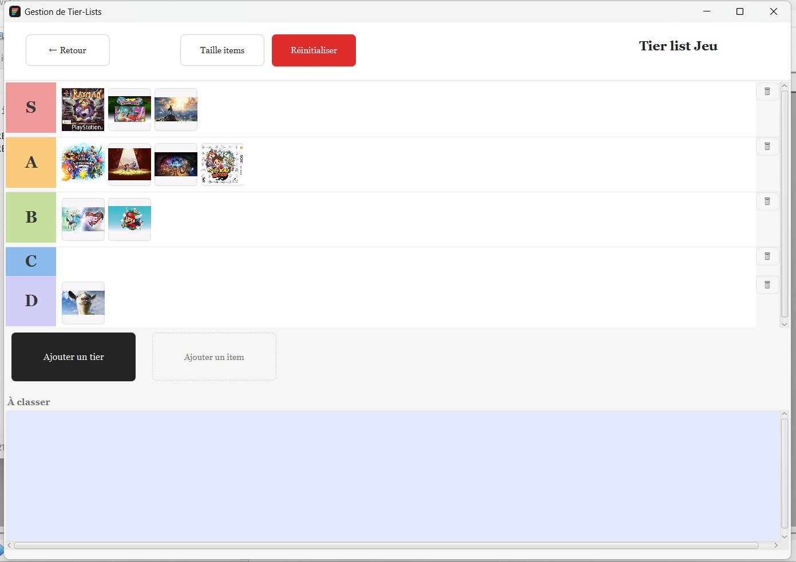
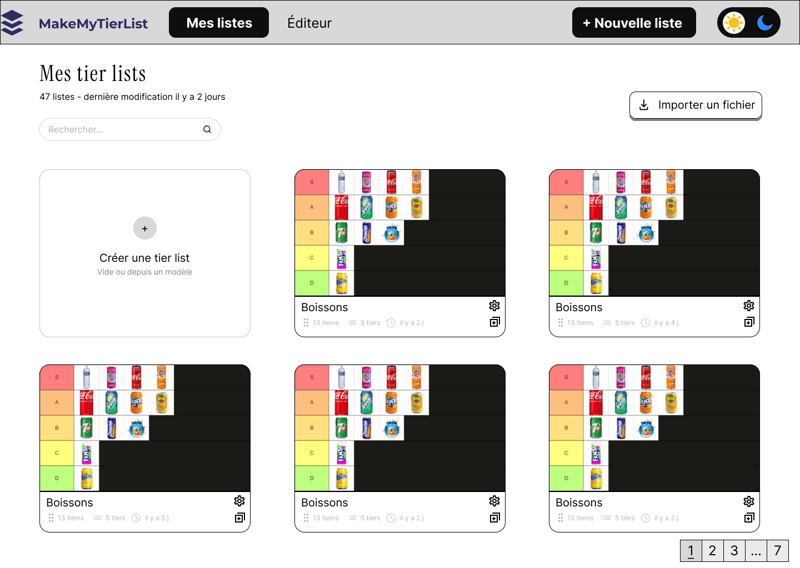
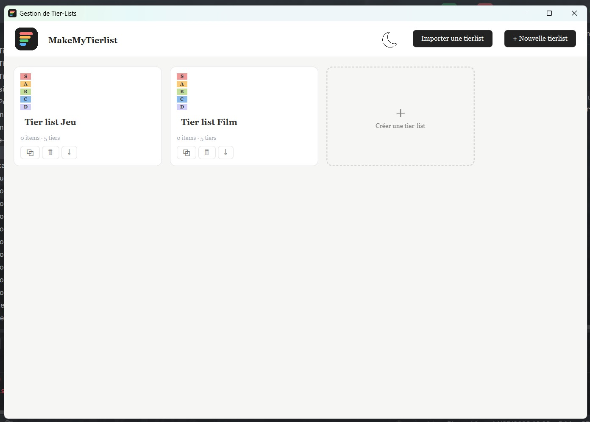
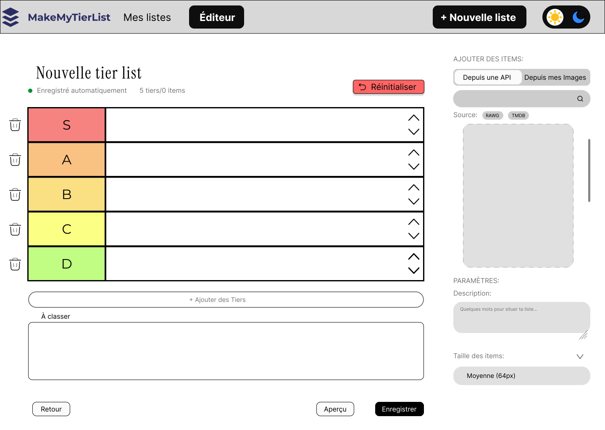

# MakeMyTierlist


**Une application de bureau pour créer, personnaliser et sauvegarder ses tier lists.**

J'ai participé au développement de MakeMyTierlist au sein d'une équipe de quatre personnes. L'application permet de classer des textes ou des images par glisser-déposer, de personnaliser ses catégories et de retrouver ses classements entre les sessions.



## 🛠️ Technologies & outils

- **Langage :** Java 21, programmation orientée objet.
- **Interface graphique :** JavaFX, vues FXML et CSS ; Scene Builder pour la conception visuelle des vues.
- **Maquettage :** maquettes papier et Figma pour préparer les écrans et les interactions.
- **Architecture :** MVC, avec séparation du modèle métier, des vues et des contrôleurs.
- **Dépendances et compilation :** Maven, Maven Wrapper (`mvnw`) et Maven Shade Plugin pour générer un JAR avec ses dépendances.
- **API externe :** RAWG, interrogée avec `HttpClient` pour rechercher des images de jeux vidéo.
- **Traitement JSON :** Jackson pour convertir les réponses de l'API en objets Java.
- **Persistance :** sérialisation binaire Java pour les sauvegardes locales et l'import/export des classements.
- **Versionnement :** Git pour le travail en équipe.

## ✨ Fonctionnalités

- Créer, renommer, dupliquer et supprimer plusieurs tier lists.
- Ajouter des éléments textuels ou des images locales.
- Classer et réordonner les éléments par **glisser-déposer**, et modifier l'ordre des catégories.
- Personnaliser le nom, la couleur et la hauteur des catégories, ainsi que la taille des éléments.
- Réinitialiser un classement en ramenant les éléments dans la zone « À classer ».
- Sauvegarder à la fermeture et restaurer les classements au démarrage.
- Importer et exporter une tier list au format binaire `.tl`.
- Rechercher des images de jeux vidéo via RAWG, avec une clé API personnelle.

## 👨‍💻 Ma contribution

Dans ce projet collectif, je me suis principalement investi dans :

- Le développement du **modèle de données** et de la logique métier associée aux tier lists, catégories et éléments.
- La mise en place de la **persistance binaire**, pour sauvegarder et restaurer les classements entre les sessions.
- La conception de l'interface à travers des **maquettes papier et Figma**.
- Une partie du développement de l'IHM en **JavaFX**, avec **Scene Builder**.

## 🎨 De la maquette à l'application

J'ai participé aux maquettes papier et Figma, puis à une partie de leur mise en œuvre en JavaFX avec Scene Builder. Ces vues permettent de comparer la conception initiale avec l'application livrée.

### Accueil : retrouver ses classements

| Maquette Figma | Application JavaFX |
| :---: | :---: |
| [](docs/images/figma-accueil.png) | [](docs/images/accueil.png) |

Le principe des cartes avec aperçu des classements est conservé. Dans l'application, les actions de duplication, de suppression et d'export sont regroupées sur chaque carte. La recherche et la pagination dessinées dans Figma ne sont pas présentes dans cette version.

### Éditeur : organiser les éléments

| Maquette Figma | Application JavaFX |
| :---: | :---: |
| [](docs/images/figma-editeur.png) | [](docs/images/editeur.png) |

Les catégories colorées et la zone « À classer » sont conservées. Le panneau latéral de la maquette est remplacé par des dialogues et des menus contextuels pour ajouter des éléments et personnaliser les catégories. RAWG est intégré ; TMDB et le thème clair/sombre restent des idées de maquette, pas des fonctionnalités réalisées.

*Les vues Figma proviennent des pages 2 et 3 de l'export fourni avec le projet. Les captures JavaFX proviennent du rapport. Cliquer sur une image pour l'agrandir.*

<details>
<summary>✏️ Voir les premières maquettes et les documents de conception</summary>

- [Maquette papier de l'accueil](docs/conception/maquette-papier-accueil.png)
- [Maquette papier de l'éditeur](docs/conception/maquette-papier-editeur.png)
- [Arbre des tâches utilisateur](docs/conception/arbre-des-taches.png)
- [Export Figma complet — 14 pages](docs/conception/maquettes-figma.pdf)

Ces documents sont les fichiers de conception d'origine. Ils peuvent présenter des pistes qui n'ont pas toutes été retenues dans l'application.

</details>

## 🧩 Conception technique

Le modèle repose sur une hiérarchie d'éléments : `Item` est spécialisée en `TextItem` et `ImageItem`. Les éléments sont regroupés dans des catégories (`Tier`), elles-mêmes organisées dans une `TierList`. Un `TierListManager` gère l'ensemble des classements.

Les vues FXML décrivent les écrans, les contrôleurs JavaFX gèrent les interactions et `PersistenceManager` assure la lecture et l'écriture des données avec `ObjectInputStream` et `ObjectOutputStream`.

La sérialisation sert également à dupliquer une tier list en créant une copie indépendante. Au chargement, le compteur d'identifiants des éléments est recalculé à partir des données restaurées.

```text
src/main/java/com/example/sae_tierlist/
├── MainApplication.java       # Démarrage et sauvegarde à la fermeture
├── Launcher.java              # Point d'entrée du JAR
├── model/                     # Classements, catégories et éléments
├── controller/                # Accueil, éditeur et dialogues JavaFX
├── persistence/               # Sauvegarde, restauration et import/export
└── api/                       # Client RAWG et objets issus du JSON
src/main/resources/
├── com/example/sae_tierlist/   # Vues FXML et feuille de style
└── image/                     # Ressources graphiques
```

## 🚀 Essayer le projet

Le projet nécessite un **JDK 21** et un environnement graphique. Après avoir téléchargé ou cloné ce dépôt, ouvrir un terminal à sa racine. Maven Wrapper récupère Maven et les dépendances au premier lancement ; une connexion Internet est donc nécessaire.

| Action | Windows (PowerShell) | Linux / macOS |
| --- | --- | --- |
| Lancer l'application | `.\mvnw.cmd javafx:run` | `sh ./mvnw javafx:run` |
| Compiler et générer le JAR | `.\mvnw.cmd clean verify` | `sh ./mvnw clean verify` |

**Recherche RAWG facultative :** définir la variable d'environnement `RAWG_API_KEY` avant de lancer l'application. Sous PowerShell : `$env:RAWG_API_KEY = "votre_cle_personnelle"` ; sous Linux / macOS : `export RAWG_API_KEY="votre_cle_personnelle"`. Les textes et images locales ne nécessitent pas cette clé. Aucun fichier `.env` n'est chargé automatiquement.

Ces indications sont tirées de la configuration Maven du dépôt. La compilation et la génération du JAR ont été vérifiées sous Windows avec Java 21. Le lancement graphique et la recherche RAWG n'ont pas été retestés lors de la mise en ligne.

## 🔧 Limites et pistes d'amélioration

- Les images locales sont enregistrées par leur chemin : un export `.tl` n'embarque pas les images et n'est pas entièrement portable entre ordinateurs.
- La recherche RAWG est synchrone et peut bloquer temporairement l'interface ; son exécution en arrière-plan serait une amélioration utile.
- L'import utilise la désérialisation Java sans filtre : seuls des fichiers `.tl` de confiance doivent être ouverts.
- Le thème clair/sombre et une suite de tests automatisés restent à développer.

## 📋 Contexte du projet

L'objectif était de développer en équipe une application de classement visuel : gérer plusieurs listes, manipuler des éléments texte ou image, organiser les catégories par glisser-déposer et conserver les données entre les sessions.

Les contraintes techniques portaient sur JavaFX, la persistance binaire et une interface capable de gérer au moins 40 éléments sous forme d'images. L'import/export, la personnalisation et l'intégration d'une API faisaient partie des extensions proposées. Ce sont les attentes du sujet, pas des résultats de tests de performance.

<details>
<summary>📄 Consulter le sujet d'origine</summary>

[Sujet du projet — PDF](docs/sujet.pdf), fourni par l'IUT de Laval. Le document est conservé tel quel ; ses intitulés et dates sont ceux du support pédagogique d'origine.

</details>

## 👥 Équipe

**Axel Hamard · Célian Gloro · Berat Dastan · Edgar Bacquaert**

Projet réalisé en première année de BUT Informatique à l'IUT de Laval. Les fonctionnalités présentées sont le résultat du travail collectif ; la section « Ma contribution » décrit mon implication personnelle.

<details>
<summary>À propos de la version publiée</summary>

Ce dépôt reprend le code du projet de groupe. Pour sa publication, la clé RAWG présente dans le code d'origine a été remplacée par une variable d'environnement, avec un message dans l'interface si elle n'est pas configurée.

Le README, les règles d'exclusion et les deux captures extraites du rapport ont été préparés pour cette présentation. Les maquettes et le sujet d'origine sont accessibles dans la documentation. Les sauvegardes personnelles, fichiers d'IDE, fichiers de compilation et le rapport complet ne sont pas inclus. L'historique public commence à l'import du projet ; il ne reconstitue pas l'historique de développement de l'équipe.

</details>
